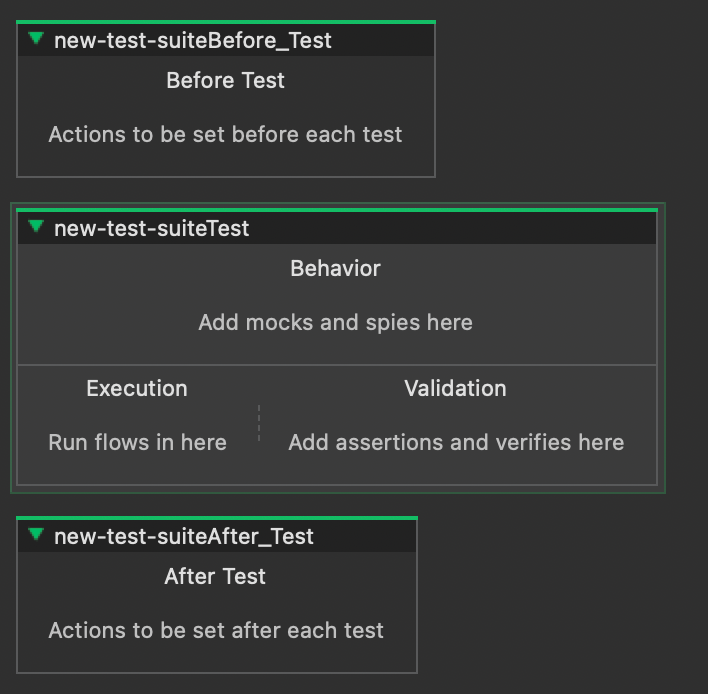
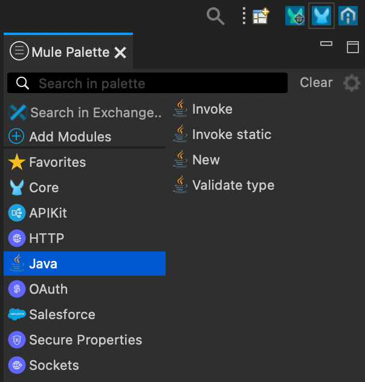
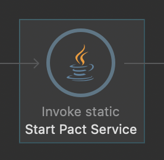
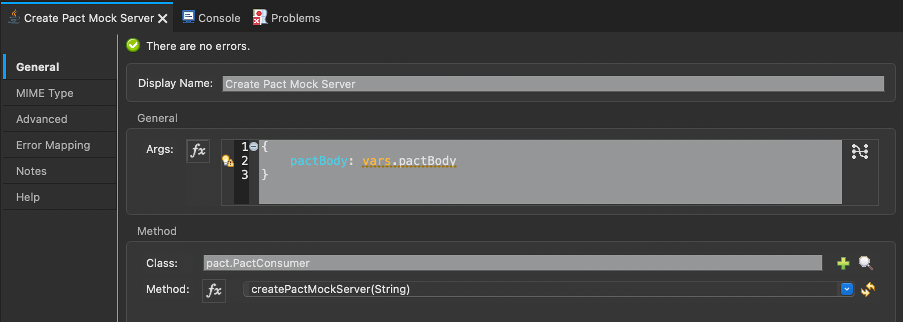

## Problem Statement

As of Mule 4, it is no longer possible to extend the MUnit runner through Java code. Previously, the solution of Pact testing with MuleSoft was to extend “FunctionalMunitSuite” in your test class. An example can be found here: https://docs.mulesoft.com/munit/1.3/munit-tests-with-Java#creating-your-suite-class

However, MuleSoft now wants alignment with the Mule language to be able to provide a better service. Which leaves the outstanding problem; How can we use Pact to test Mule 4 applications?

In a nutshell, the solution is to have MUnit be the test runner and execute the standalone Pact-JVM server by calling Java code within the MUnit console. This will allow for both the benefit of MUnit tests along with pact files being created for contract testing. As a result, we will be able to leverage the MUnit unit test coverage while also generating our pact files and publishing them to a Pact Broker or sharing them into your own file storage system.

## Consumer

### So how do we do it?

First, we need to understand the MUnit test layout. It has a very similar test structure to other unit testing tools, such as Jest, jUnit, nUnit, etc., with the usual before suite, before test, after test, and after suite. The test logic is formed into the test blocks where “flows” are executed in the test scripts. 

An empty MUnit test would look like the following:



In the test block, we can see it is divided into three sections; execution, behavior, and validation. The assertions for tests come from MUnit tools providing a low code UI block that we configure for each type of unit test assertion we wish to perform on the flow.

Looking through the Mule Palette, in addition to these low code blocks there are also Java blocks for writing Java classes with the ability to call functions. 

The functionality of these blocks is as follows:

- New: creates a new class
- Invoke static: invoke static methods
- Invoke: invoke methods on an instantiated class
- Validate type: check instance is of a given class



For this recipe, we will be utilizing all but the ‘Validate type’ Java block, but you are welcome to use it in your own solution.

### Starting the Pact JVM from Java

To use the standalone JVM of Pact we will need to create a static class called PactService. This will handle the command to run and close the Pact Standalone Server. The class will have the following functions:

- `startPactService()`: will start the service through the CLI command
- `stopPactService()`: will stop the Java process

```java
public static Process startPactService() throws IOException, InterruptedException {
  String command = "pact-jvm-server "
		+ pactServicePort
		+ " -l "
		+ mockPactServerPort
		+ " -u "
		+ mockPactServerPort
		+ " --broker "
		+ brokerUrl
		+ " -v 3";

	Process pactService = Runtime.getRuntime().exec(command);

	return pactService;
}

public static void stopPactService() throws ClientProtocolException, IOException {
	pactService.destroy();
}
```

By setting the service to a variable, we will be able to then stop the running process later with the `.destroy()` command.

More information on the Pact JVM can be found here: https://docs.pact.io/implementation_guides/jvm/pact-jvm-server

#### From Anypoint Studio

From Anypoint Studio, we will use the "Invoke Static" Java block to call the `startPactService()` method within the PactService class. 

This will start running the Pact standalone server as a separate Java process on the machine.



### Creating a Mock Service

Now that we have the service running, all we need to do is make some API calls to localhost with the port. We can use the Java "Invoke static" mule widget for this as we only need to make API calls to set up the Mock API Provider. 

Here is an example of using a CloseableHttpClient but you can use any preferred method for making the API calls from Java.

```java
public static void createPactMockServer(String pactBody) throws ClientProtocolException, IOException, InterruptedException {
  CloseableHttpClient client = HttpClients.createDefault();
  HttpPost post = new HttpPost("http://localhost:" + pactServicePort + "/create?state=NoUsers&path=/sub/ref/path");
  ResponseHandler<String> handler = new BasicResponseHandler();

  post.setHeader("Content-Type", "application/json");
  post.setEntity(new StringEntity(pactBody));

  client.execute(post, handler);

  close();
}
```

The variable pactServicePort is the port that the Pact service is running on. The pactBody can be passed from another Java function that can use the `ConsumerPactBuilder` to set up the pact interactions that would be required to be sent. 

This would be very similar to the example logic provided here: https://docs.pact.io/implementation_guides/jvm/consumer

When setting up the `pactBody` variable, I found the need to use the "New" and "Invoke" Mule Java blocks in order to avoid errors. However, there might be other solutions where static methods can be used like the rest of the solution.

#### From Anypoint Studio

An example setup from Anypoint Studio would be like the below image passing a variable from another Java class.



#### Hooking up to MUnit test

Finally, to connect to the service, all you need to do is set the API URL to localhost. This can be done through environment variables or other techniques that you would use for writing MUnit tests normally.

## Provider

Running provider tests is incredibly simpler than the Consumer side of the contract. You can simply use the Pact Maven plugin found in the Pact docs here: https://docs.pact.io/implementation_guides/jvm/provider/maven

To run the provider tests you will need to use the command: `mvn pact:verify`

## Mule 3 and Lower Solution:

Using Mule 3 or lower? Check out this example repo by Michael Hyatt: https://github.com/michaelhyatt/mule-pact
